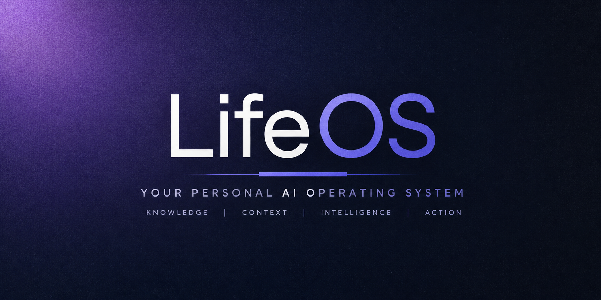

<p align="center">
  
</p>

# LifeOS

> **A personal AI operating system that evolves from document retrieval into personal context, identity, reasoning, and eventually agentic assistance.**

LifeOS is a modular AI system designed to build a progressively richer representation of a person's digital life.

It starts with classical RAG — ingestion, chunking, embeddings, vector retrieval, and reranking — and progressively adds structured knowledge, multimodal understanding, people and identity, and personal context.

---

## Vision

```text
Files
  ↓
Knowledge
  ↓
Structured Data
  ↓
Multimodal Understanding
  ↓
People & Identity
  ↓
Personal Context
  ↓
Entities & Relationships
  ↓
Reasoning
  ↓
Personal Intelligence
  ↓
Agentic Assistance
```

The system is intentionally built incrementally so each layer has a clear responsibility and can be tested independently.

---

## What LifeOS Can Do Today

- Document and file ingestion
- Text chunking and embedding generation
- Persistent ChromaDB vector storage
- Semantic retrieval and reranking
- Filename-aware and hybrid file discovery
- Structured CSV discovery and querying
- LLM-based intent planning
- Deterministic intent execution
- Multimodal/image understanding
- Image visual metadata
- Person/face identity storage and retrieval
- Multimodal candidate resolution
- Persistent personal context
- Typed context such as schedules, routines, preferences, and goals
- Temporal context with validity windows
- Active-context resolution
- Query-relevant context filtering
- Context composition and grouping
- Deterministic context conflict resolution
- Context freshness filtering
- Personal context passed into the existing LLM decision boundary

---

## Architecture

LifeOS separates **LLM reasoning/planning** from **deterministic execution**.

```text
                         ┌─────────────────────┐
                         │     User Query      │
                         └──────────┬──────────┘
                                    │
                                    ▼
                         ┌─────────────────────┐
                         │ Intelligence Layer  │
                         │                     │
                         │ LLM → IntentPlan    │
                         └──────────┬──────────┘
                                    │
                                    ▼
                         ┌─────────────────────┐
                         │ Intelligence Router │
                         │ deterministic       │
                         │ dispatch            │
                         └──────────┬──────────┘
                                    │
                 ┌──────────────────┼──────────────────┐
                 ▼                  ▼                  ▼
          Document Search     Structured Query    Multimodal Search
                 │                  │                  │
                 └──────────────────┼──────────────────┘
                                    │
                                    ▼
                         ┌─────────────────────┐
                         │ Retrieval / Context │
                         │ embeddings          │
                         │ ChromaDB            │
                         │ reranking           │
                         │ personal context    │
                         └──────────┬──────────┘
                                    │
                                    ▼
                         ┌─────────────────────┐
                         │     QueryResult     │
                         └─────────────────────┘
```

### Core design principle

> **The LLM decides what the user wants. Python decides how to execute it.**

This keeps database, retrieval, and execution operations deterministic, testable, and extensible.

---

## Retrieval Pipeline

```text
Document
   ↓
Ingestion
   ↓
Chunking
   ↓
Embedding
   ↓
ChromaDB
   ↓
Query Embedding
   ↓
Candidate Retrieval
   ↓
Reranking / Resolution
   ↓
Relevant Evidence
```

Metadata is stored alongside retrieved objects so LifeOS can reason about sources, document types, media types, file paths, people, and other retrieval signals.

---

## Intelligence Pipeline

```text
User Query
    ↓
LLM Planner
    ↓
IntentPlan
    ↓
Intelligence Router
    ↓
Deterministic Tool
    ↓
QueryResult
```

Supported intent categories include:

- File discovery
- Document search
- Structured discovery
- Structured queries
- Multimodal search
- People search
- Schedule queries
- Current-time queries

This allows new capabilities to be added without turning the LLM into an unrestricted execution engine.

---

## Personal Context

LifeOS includes a persistent context layer designed to behave more like personal memory than ordinary document retrieval.

Context can have:

- A key
- A value
- A type
- An update timestamp
- A validity start
- A validity end

Example:

```text
current_class
    value: DBMS
    type: schedule
    valid_from: 08:00
    valid_until: 10:00
```

The context pipeline is:

```text
Stored Context
      ↓
Temporal Validation
      ↓
Active Context
      ↓
Query Relevance
      ↓
Context Composition
      ↓
Conflict Resolution
      ↓
Freshness Filtering
      ↓
LLM Decision Boundary
```

This provides the foundation for interactions such as:

> "Which class do I have now?"

where the system can use currently valid personal context instead of requiring the user to restate it.

---

## Multimodal Understanding

```text
Image
  ↓
Vision Analysis
  ↓
Visual Metadata
  ↓
Embedding
  ↓
Vector Storage
  ↓
Multimodal Retrieval
  ↓
Candidate Resolution
```

People metadata can also be associated with image-derived knowledge, creating a foundation for identity-aware retrieval.

---

## People & Identity

The identity layer provides persistent storage for people and face embeddings.

```text
Person
 ├── person_id
 ├── label
 ├── status
 └── face embeddings
```

This forms the foundation for future identity-aware reasoning across documents, images, events, and relationships.

---

## Technology Stack

| Layer | Technology |
|---|---|
| Language | Python |
| LLM interface | OpenAI-compatible API / OpenRouter |
| Embeddings | Sentence Transformers |
| Vector database | ChromaDB |
| Structured data | Pandas / CSV |
| Document parsing | PyPDF, python-docx |
| Vision / face recognition | InsightFace, OpenCV, ONNX Runtime |
| Validation | Pydantic |
| Persistence | SQLite + ChromaDB |
| File watching | Watchdog |
| Testing | Pytest |

Dependencies are pinned in `requirements.txt`.

---

## Repository Structure

```text
LifeOS/
├── app/
│   ├── context/          # Personal context storage and resolution
│   ├── embeddings/       # Embedding generation
│   ├── ingestion/        # File and structured-data ingestion
│   ├── intelligence/     # Planning and intent routing
│   ├── knowledge/        # Knowledge and people-related components
│   ├── llm/              # LLM interaction
│   ├── processing/       # Processing utilities
│   ├── prompting/        # Prompting components
│   ├── query/            # Deterministic query execution
│   ├── retrieval/        # Retrieval and reranking
│   ├── vectordb/         # ChromaDB storage
│   ├── config.py
│   ├── main.py
│   └── reindex.py
│
├── data/
├── tests/
├── requirements.txt
└── readme.md
```

---

## Development Philosophy

### 1. Deterministic execution
LLMs should plan or interpret; deterministic Python code should perform the actual operation.

### 2. Evidence over guessing
Retrieval systems should expose source evidence and metadata rather than relying entirely on generated answers.

### 3. Modular architecture
Each capability lives behind a clear module boundary so it can be tested and replaced independently.

### 4. Progressive intelligence
Higher-level intelligence is built on lower-level capabilities instead of bypassing them.

### 5. General solutions
The system should solve classes of problems rather than hardcode individual queries.

### 6. Test before claiming completion
New capabilities are accompanied by deterministic tests, while live-LLM behavior is treated separately from unit/integration logic.

---

## Roadmap

### Completed

- [x] Phase 1 — Foundation
- [x] Phase 2 — Knowledge Ingestion
- [x] Phase 3 — RAG & Retrieval
- [x] Phase 4 — Structured & Advanced Knowledge
- [x] Phase 5 — Intelligence Layer
- [x] Phase 6A — Multimodal Understanding
- [x] Phase 6B — People & Identity
- [x] Phase 6C — Deeper Multimodal Intelligence
- [x] Phase 7 — Personal Context

### Next

- [ ] Phase 8 — Entity & Relationship Intelligence
- [ ] Phase 9 — Advanced Reasoning & Personal Intelligence
- [ ] Phase 10 — Agentic LifeOS
- [ ] Phase 11 — Product / API / Security Layer
- [ ] Phase 12 — Production LifeOS

---

## Testing

Run the complete test suite:

```powershell
$env:PYTHONPATH="app"
.\.venv\Scripts\python.exe -m pytest -q
```

LLM-facing integration tests should mock external model calls where deterministic behavior is required.

---

## Why This Architecture?

A naive implementation could send every query directly to an LLM and ask it to search files, query databases, interpret images, and remember personal information.

LifeOS deliberately separates these responsibilities.

The system needs:

- predictable execution
- inspectable retrieval
- reproducible tests
- explicit data boundaries
- source-aware results
- controllable context
- replaceable components
- a path toward safe tool execution

The goal is to build intelligence **on top of reliable infrastructure**, not replace that infrastructure with a single prompt.

---

## Project Status

LifeOS is an **active engineering project**, not a finished commercial product.

The current focus is building the knowledge, identity, context, reasoning, and relationship foundations required for a future personal AI operating system.

---

## Author

**Krupaal / HNK69**

Built as an ongoing engineering project exploring:

- RAG systems
- retrieval architecture
- multimodal AI
- personal knowledge systems
- LLM planning
- deterministic tool execution
- context-aware AI
- agentic system design

---

## License

License information will be added when the project's licensing decision is finalized.
